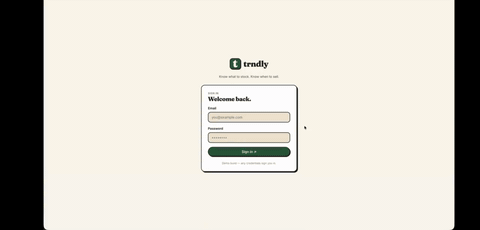

# trndly

Fashion trend forecasting for secondhand apparel resellers. A monthly
batch tick scrapes retailer catalogs, retrains two RandomForest
regressors, and **precomputes 6-horizon catalog-share forecasts** for
the entire universe of (dimension, level) pairs and 5-D fingerprints.
The FastAPI service is a read-only layer over the predictions parquet —
no live `model.predict()` calls in the request path.

## Demo

Product preview:



## Repo layout

The project root has minimal scaffolding; the code lives one level down
in `trndly/`.

```
.
├── README.md                  ← this file
├── trndly_demo.gif            ← product preview recording
├── TODO.md                    ← forward-looking work list
├── project_materials/         ← pitch deck, demo videos, checkpoints
└── trndly/                    ← the application
    ├── pipelines/
    │   ├── paths.py           — central path registry
    │   ├── contracts.py       — schema validators
    │   ├── cube_slicing.py    — shared cube → feature-row helpers
    │   ├── collectors/        — 4 retail scrapers + build_live_cube.py
    │   └── monthly/           — the monthly tick (scrape → ... → predict)
    ├── backend/services/
    │   └── scheduleServer.py  — FastAPI service (read-only over predictions)
    ├── frontend/              — React SPA, no build step (JSX-via-Babel + in-house useFetch hook)
    ├── notebooks/             — 0 (Kaggle clean), 1 (historical agg), 4 (HP sweep)
    ├── EDA/                   — exploratory data/training/transaction notebooks
    ├── tests/                 — unit, contract, and integration tests
    ├── data/                  — raw / reference / processed / models / predictions
    └── docs/                  — architecture, API reference, monthly-tick runbook
```

Two RandomForest regressors:

- **Univariate** — one row per `(dimension, level_id)`. Powers trend exploration.
- **Fingerprint** — one row per 5-D `(product_type, gender, color_master, graphical_appearance, material)`. Powers per-item recommendations.

## Quick start

```bash
cd trndly                                                  # the inner package dir
python -m venv .venv
./scripts/setup_venv.sh                                    # pip install + playwright install chromium

# One-time bootstrap from the H&M Kaggle dump (places it in data/raw/kaggle/)
.venv/bin/python notebooks/_run_notebook.py notebooks/0_clean_historical.ipynb
.venv/bin/python notebooks/_run_notebook.py notebooks/1_aggregate_historical.ipynb

# Monthly tick: scrape → aggregate → features → train → evaluate → predict
.venv/bin/python -m pipelines.monthly run

# Or skip scrape if items_*.csv already on disk
.venv/bin/python -m pipelines.monthly run --skip-scrape

# (Stopgap, today only) Backfill synthetic Feb/Mar/Apr 2026 lag rows so
# the predictor can anchor on the most recent live scrape (2026-05)
# instead of falling back to the 2020-08 historical block. Re-run
# pipelines.monthly predict afterward. Remove once ≥4 contiguous live
# months have been scraped — see TODO.md "Sparse cube" section.
.venv/bin/python scripts/backfill_anchor_lags.py
.venv/bin/python -m pipelines.monthly predict

# Serve the API (FastAPI + static React UI at /ui)
.venv/bin/python -m uvicorn backend.services.scheduleServer:app --port 8000
```

Then open `http://localhost:8000/ui/` for the React app or
`http://localhost:8000/docs` for Swagger UI.

## The monthly tick

`python -m pipelines.monthly run` drives six stages end-to-end:


| Stage       | What it does                                         | Output                                                       |
| ----------- | ---------------------------------------------------- | ------------------------------------------------------------ |
| `scrape`    | Subprocess each retailer scraper + `build_live_cube` | `data/raw/items/`, `data/processed/live_*_<YYYY-MM>.parquet` |
| `aggregate` | Concat historical + live cubes with dedup            | `data/processed/merged_*.parquet`                            |
| `features`  | Calendar-strict windowing (lags + 6 targets)         | `data/processed/training_*.parquet`                          |
| `train`     | Fit RandomForest, write run metrics, persist joblibs | `data/models/*.joblib`, `model_training_run.json`            |
| `evaluate`  | Compare candidate vs incumbent WMAE; auto-promote    | `data/models/champion_metrics.json` (on promotion)           |
| `predict`   | Score the universe, classify state, write parquet    | `data/predictions/predictions_*_<YYYY-MM>.parquet`           |

The tick is self-contained and writes everything to local disk — no
cloud calls. (See **MLflow & cloud infra** below for what *does* talk to
the cloud, and when.)

Stages are also runnable individually:

```bash
python -m pipelines.monthly aggregate
python -m pipelines.monthly evaluate
```

After a tick, restart the FastAPI service to pick up the new predictions.

See [trndly/docs/monthly_tick.md](trndly/docs/monthly_tick.md) for the
full operator runbook (prereqs, debugging, common failures).

### Champion model management (local-MVP)

`evaluate` is explicitly the **local-MVP** version: the champion is a
local `data/models/champion_metrics.json` file, not an MLflow registry
alias. Promotion rule: `candidate.holdout_wmae <= incumbent.holdout_wmae`
→ promote (or promote if no incumbent recorded). Note that `train`
overwrites the joblib models before `evaluate` runs, so a candidate that
loses the comparison is not auto-reverted — only the champion-metrics
pointer is left unchanged. Registry-backed champion aliasing is the
target architecture (see [docs/architecture.md](trndly/docs/architecture.md)),
not the current behavior.

## MLflow & cloud infra

The tick and the serving path are **fully local**; the only cloud touch
point is model development:

- **Monthly tick** — no MLflow. `train` writes joblibs +
  `model_training_run.json`; `evaluate` manages a local
  `champion_metrics.json`. There are no `mlflow.*` calls anywhere in
  `pipelines/monthly/`.
- **Serving** (`backend/services/scheduleServer.py`) — reads precomputed
  predictions parquets from local disk; no live model calls. The
  `MLFLOW_*` variables in `backend/services/.env` are **leftovers** from
  an older registry-backed serving design and are not referenced in the
  request path.
- **Model development / HP sweeps** — `notebooks/_gen_4_hyperparameter_search.py`
  logs runs to a self-hosted MLflow tracking server when `MLFLOW_TRACKING_URI`
  is set (otherwise a local SQLite `mlflow.db`, gitignored). That development
  server has since been **retired**; a hardened, private replacement (Cloud Run
  + Cloud SQL + GCS) is planned — see
  [docs/serving-redesign.md](trndly/docs/serving-redesign.md). It was never
  used by the tick or the API.

## API surface

All routes are `GET`; no POST triggers a model call.


| Route                                                                                                          | Behavior                                               |
| -------------------------------------------------------------------------------------------------------------- | ------------------------------------------------------ |
| `GET /options`                                                                                                 | Dropdown vocabularies, `[{name, id}]` per category     |
| `GET /trends`                                                                                                  | Univariate predictions. Filters: `?dimension=&state=`  |
| `GET /forecast/fingerprint?product_type_id=&gender_id=&color_master_id=&graphical_appearance_id=&material_id=` | One fingerprint forecast (404 if no precomputed match) |
| `GET /health`                                                                                                  | Bundle status + anchor month + `lags_synthetic` flag   |
| `/ui/*`                                                                                                        | Static React app                                       |


Full request/response shapes in [trndly/docs/api.md](trndly/docs/api.md).

## Testing

```bash
cd trndly
.venv/bin/python -m pytest tests/         # full suite
.venv/bin/python -m pytest tests/monthly/ # tick-stage unit tests
```

250+ tests (253 collected from 107 test functions, expanded by
parametrization) covering schema validators, lookup-csv consistency,
cube concat-compatibility, items-CSV ID validity, trend-state
classification, evaluator promotion logic, and scraper retry/dedup
logic.

Live retailer smoke checks are gated behind `pytest -m live` (skipped by
default via `addopts = -m "not live"` in `pytest.ini`).

CI runs the suite on every push and pull request to `main` (and on
manual dispatch) via
[`.github/workflows/tests.yml`](.github/workflows/tests.yml) on
Python 3.11, uploading a junit report as an artifact.

## Documentation

- [trndly/docs/architecture.md](trndly/docs/architecture.md) — shipped architecture + future GCP target
- [trndly/docs/api.md](trndly/docs/api.md) — endpoint reference with example bodies
- [trndly/docs/monthly_tick.md](trndly/docs/monthly_tick.md) — operator runbook
- [trndly/docs/rationale.md](trndly/docs/rationale.md) — design decisions (in-house useFetch vs SWR, SPA, IaC)
- [trndly/pipelines/collectors/README.md](trndly/pipelines/collectors/README.md) — scrapers, items.csv schema, brittle areas
- [trndly/data/reference/SCHEMA.md](trndly/data/reference/SCHEMA.md) — per-dimension reachability audit
- [TODO.md](TODO.md) — forward-looking work + brittle-area watchlist

## Status

**Shipped:** monthly batch architecture (manual cadence), precomputed predictions, local-file champion management, read-only FastAPI service, React frontend wired to the API via an in-house `useFetch` hook.

**Future** (out of scope for current MVP):

- Storage migration: local parquet → GCS / BigQuery
- Cloud cadence: manual CLI → Cloud Scheduler + Vertex Custom Container job
- Champion management: local `champion_metrics.json` → MLflow registry alias (`set_registered_model_alias`) on the GCP-backed registry, with auto-revert on demotion
- Frontend hosting split: Firebase Hosting (static) + Cloud Run (API)
- Auth: Firebase Auth + per-user inventory in Firestore
- Container split: separate images for collectors / monthly tick / API
