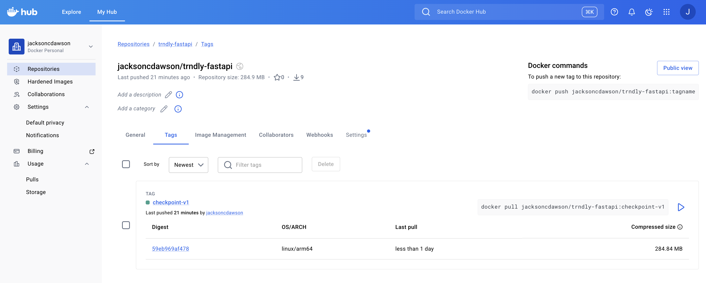

# 1. Github Repository

[Link to Github Repository](https://github.com/jacksoncdawson/MLOps-Project)

[Direct Link to API endpoint Definitions](https://github.com/jacksoncdawson/MLOps-Project/blob/main/trndly/backend/services/scheduleServer.py)

# 2. Docker Image Proof



Command used to build the image:

```bash
docker build -t jacksoncdawson/trndly-fastapi:checkpoint-v1 .
```

Command used to push the image to Artifact Registry:

```bash
docker push jacksoncdawson/trndly-fastapi:checkpoint-v1
```

# 3. Run Instructions

[Refer to the README.md file in the trndly directory for run instructions.](https://github.com/jacksoncdawson/MLOps-Project/blob/main/README.md)
